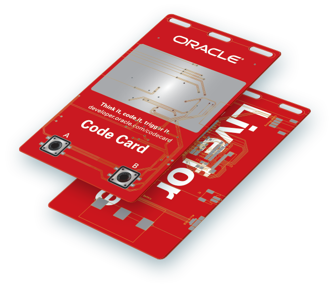
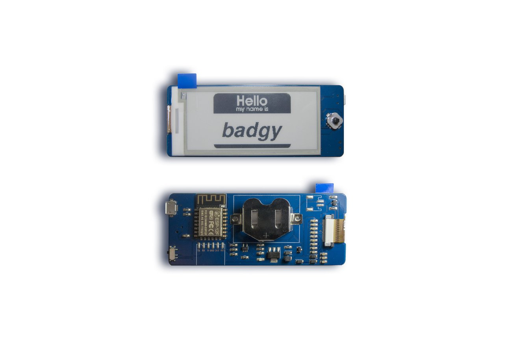

# The Code Card

Code Card is a Wi-Fi-enabled device with an e-paper display that can retrieve content from Oracle Cloud. Code Cards are available on a first-come basis to Oracle OpenWorld and Oracle Code One attendees who sign up for a cloud trial account. Stop by the Groundbreakers Hub to sign up and start configuring your Code Card.

There are loads of things that you can do with your Code Card - here's a list of documentation, work instructions, & code to get you up and running:

## Instructions

- **[Configuration Settings](/terminal/)**  
Manage your Code Card configuration via serial connection over USB. Settings such as Wi-Fi SSID & Password can be managed via serial connection using the Code Cards integrated CLI.
  - **[Terminal Emulator](https://github.com/cameronsenese/codecard/blob/master/terminal/README.md#alternative-via-terminal-emulator)**  
Manually configure your Code Card using a serial connection over USB. Initiate a serial connection using your favourite terminal emulation package (Putty, etc.) and configure your Code Card using the integrated CLI.
  - **[Code Card Configurator](https://github.com/cameronsenese/codecard-configurator)**  
Python script to automatically configure Code Card settings using serial connection over USB. Useful for restting Code Card settings back to default, or to save and batch apply custom settings.  
The Code Card Configurator uses the pyserial module to perform configuration updates.

- **[Programming the Code Card Firmware](/arduino/)**  
We have included the source code here so you can modify you Code Card however you want!  
Instructions for setting up the Arduino IDE to program and upload your customisations to the Code Card Firmware.

## How did we build the Code Card?
We partnered with [Squarofumi](http://www.sqfmi.com/), creators of [Badgy](https://www.tindie.com/products/squarofumi/badgy-iot-badge/), an IoT badge, to create the Code Card.

